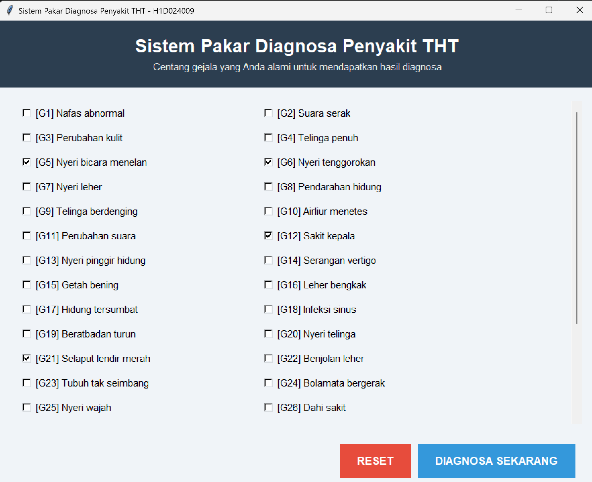
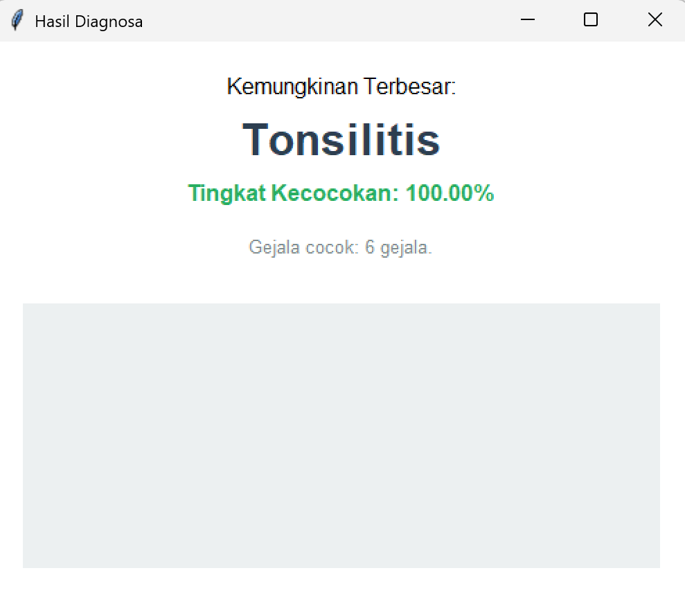

# Sistem Pakar Diagnosa Penyakit THT

Laporan Praktikum Kecerdasan Buatan - Pertemuan 5

**Nama:** Yakfi
**NIM:** H1D024114

---

## Gambaran Aplikasi

Aplikasi ini merupakan sebuah **Sistem Pakar Diagnosa Penyakit Telinga, Hidung, dan Tenggorokan (THT)** berbasis Desktop (GUI) yang dibangun menggunakan Python beserta library Tkinter. Sistem ini menggunakan metode _forward chaining_ sederhana (berdasarkan persentase kecocokan gejala), di mana pengguna dapat memilih berbagai gejala yang dirasakan melalui elemen _checkbox_.

Setelah pengguna memilih gejala, sistem akan memproses data tersebut berdasarkan basis pengetahuan dan aturan (rule) dari modul yang ada. Hasil kalkulasi berupa persentase kecocokan dari masing-masing penyakit akan ditampilkan, menyoroti diagnosis dengan kemungkinan terbesar di posisi atas, diikuti oleh probabilitas penyakit lainnya sebagai informasi tambahan.

## Knowledge Base (Basis Pengetahuan)

Sistem ini memuat 37 gejala utama yang diidentifikasi dari G1 hingga G37. Beberapa contoh gejala tersebut adalah:

- G1: Nafas abnormal
- G37: Demam
- G12: Sakit kepala
- G5: Nyeri bicara menelan
- dan gejala lainnya.

Sementara itu, Rule Base (Basis Aturan) menyimpan data untuk 23 penyakit THT, seperti:

- **Tonsilitis:** [G37, G12, G5, G27, G6, G21]
- **Sinusitis Maksilaris:** [G37, G12, G27, G17, G33, G36, G29]
- **Abses Peritonsiler:** [G37, G12, G6, G15, G2, G29, G10]
- **Faringitis:** [G37, G5, G6, G7, G15]
- dan daftar penyakit THT lainnya...

## Panduan Menjalankan Program

Karena Tkinter adalah _built-in standard library_ di Python, pastikan sistem Anda sudah terinstal Python (versi 3.x ke atas) untuk menjalankannya.

1. _Clone_ repositori ini atau unduh kode sumbernya secara langsung.
2. Buka _command prompt_ atau terminal, lalu arahkan ke direktori proyek ini.
3. Eksekusi aplikasi menggunakan perintah:
   ```bash
   python main.py
   ```
4. Setelah antarmuka GUI terbuka, silakan pilih (centang) semua gejala yang Anda alami saat ini.
5. Tekan tombol **DIAGNOSA SEKARANG** untuk memulai proses analisis. Jendela baru akan muncul untuk menampilkan hasil prediksi penyakit lengkap dengan persentasenya.

## Rincian Struktur Kode

- **Dictionary `data_gejala`:** Berfungsi sebagai pemetaan antara ID Gejala (misalnya: "G1") dan deskripsi gejala terkait (misalnya: "Nafas abnormal").
- **Dictionary `data_penyakit`:** Bertindak sebagai tabel basis pengetahuan. Nama penyakit digunakan sebagai _key_, sedangkan nilai (_value_)-nya adalah _list_ yang memuat rangkaian ID Gejala.
- **Class `AplikasiSistemPakar (tk.Tk)`:** Komponen antarmuka utama program yang mewarisi _library_ `tkinter`.
  - **Method `create_widgets()`:** Bertanggung jawab untuk merender elemen antarmuka (UI), termasuk penyusunan _checkbox_ di dalam kanvas yang mendukung _scroll_.
  - **Method `diagnosa()`:** Berperan sebagai _Inference Engine_. Method ini membandingkan input gejala dari pengguna dengan data pada basis pengetahuan (dengan prinsip _Intersection of Set_), kemudian mengalkulasi tingkat kecocokannya. Hasil evaluasi diurutkan secara menurun dari probabilitas yang paling tinggi.
  - **Method `tampilkan_hasil()`:** Berfungsi untuk memunculkan _popup_ yang merangkum hasil prediksi penyakit THT dengan peluang terbesar.

## Galeri Output

Di bawah ini adalah dokumentasi _screenshot_ dari pengoperasian aplikasi Sistem Pakar Diagnosa THT:

### 1. Antarmuka Utama (Pilihan Gejala)


_Tangkapan layar di atas memperlihatkan antarmuka awal aplikasi. Tersedia checkbox untuk memilih di antara 37 gejala yang diadopsi dari modul._

### 2. Antarmuka Hasil Diagnosa


_Tangkapan layar ini menampilkan popup hasil analisis setelah tombol "Diagnosa Sekarang" diklik. Jendela ini menjabarkan persentase kecocokan mulai dari diagnosis utama hingga penyakit sekunder lainnya._

---

_(Tugas selesai di waktu praktikum -- CPMK)_
